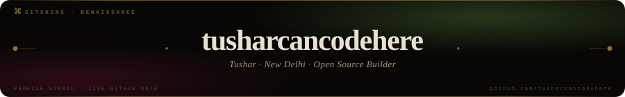
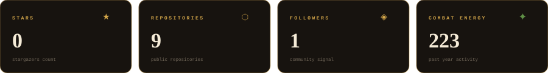
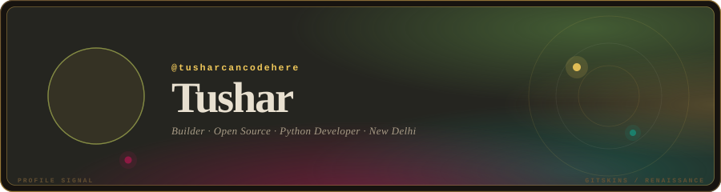
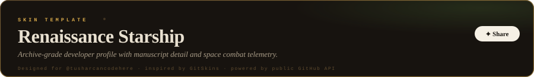
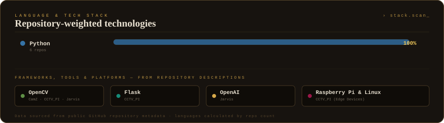
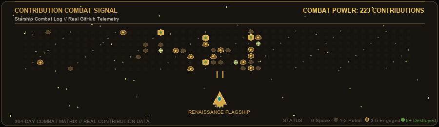
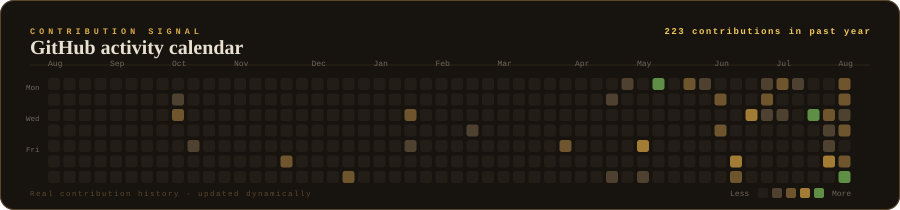
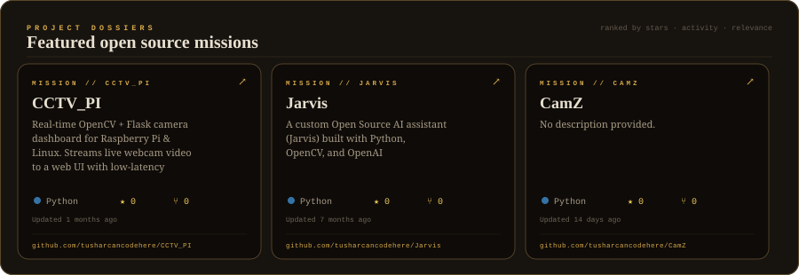
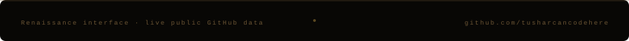

<!--
  ╔══════════════════════════════════════════════════════════════════════╗
  ║  tusharcancodehere / tusharcancodehere                              ║
  ║  GitHub Profile README — Renaissance Starship · GitSkins             ║
  ║                                                                      ║
  ║  All displayed data is sourced from public GitHub API.               ║
  ║  Run  node scripts/update-profile.js  to regenerate SVG & GIF.      ║
  ╚══════════════════════════════════════════════════════════════════════╝
-->

<!-- ── 1. RENAISSANCE HEADER ─────────────────────────────────────────── -->

  

---

<!-- ── 2. PROFILE INTRODUCTION & IDENTITY ────────────────────────────── -->

  

<h1 align="center">
  Tushar
</h1>

  <code>@tusharcancodehere</code>
  &nbsp;·&nbsp;
  <samp>New Delhi, India</samp>

  
  &nbsp;
  

---

<!-- ── 3. GITHUB STATISTICS (RENAISSANCE PLAQUES) ─────────────────────── -->

  

---

<!-- ── 4. PROFILE SIGNAL ──────────────────────────────────────────────── -->

  

---

<!-- ── 5. RENAISSANCE SKIN CARD ──────────────────────────────────────── -->

  

---

<!-- ── 6. LANGUAGE STACK ──────────────────────────────────────────────── -->

  

---

<!-- ── 7. CONTRIBUTION SIGNAL (ANIMATED SPACE-SHOOTER COMBAT SCENE) ───── -->

  

  <samp>223 contributions over the last year converted into starship combat energy.</samp>

<samp>◈ Static Contribution Matrix Fallback</samp>

 

  

---

<!-- ── 8. FEATURED PROJECTS ───────────────────────────────────────────── -->

  

<!-- Clickable repository mission links -->

  
  &nbsp;&nbsp;
  
  &nbsp;&nbsp;
  

---

<!-- ── 9. CONNECT ─────────────────────────────────────────────────────── -->

  <samp>⌘ &nbsp; Connect</samp>

  
  &nbsp;
  
  &nbsp;
  

<!-- ── 10. FOOTER ─────────────────────────────────────────────────────── -->

  

